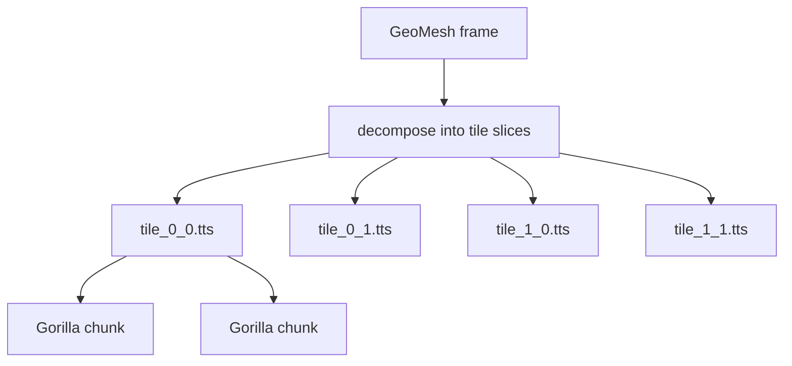

# Time-series API — `glen/timeseries`, `glen/tilestack`

Two standalone storage engines optimized for very different workloads:

- **`glen/timeseries`** — **single scalar stream** per file. Write a flood of
  `(timestamp, float64)` per second; query by time window. Gorilla-encoded.
- **`glen/tilestack`** — **2-D raster that evolves through time**. Write a
  full mesh per frame; query by frame, by time window, or by single cell
  history. Gorilla-encoded per cell.

Both share the bit-packing primitives in `glen/bitpack` (delta-of-delta
timestamps, XOR float encoding) and use a decoded-chunk LRU
(`glen/chunkcache`) on the read path.

## Gorilla scalar TSDB

One file per series, append-only, designed for many `(int64, float64)` per
second.

### Open / append

```nim
import glen/timeseries

let cpu = openSeries("./metrics/cpu.gts",
                     blockSize = 4096,
                     fsyncOnFlush = false,
                     decodedChunkCacheSize = 64)

cpu.append(tsMillis, value)
cpu.append(nowMillis(), 0.42)         # current wall time

cpu.flush()       # force pending samples to a new chunk on disk
cpu.close()       # also flushes
```

| Param | Default | Notes |
|---|---|---|
| `blockSize` | 4096 | Samples per chunk; larger = better compression, slower flush |
| `fsyncOnFlush` | false | true → fsync(2) every flush (durable, slow) |
| `decodedChunkCacheSize` | 64 | LRU slots for decoded chunks |

### Query

```nim
# Inclusive [from, to] range scan
for (ts, v) in cpu.range(fromMs, toMs): echo ts, " ", v

# Latest N (chronological order)
for (ts, v) in cpu.latest(100): echo ts, " ", v

# Whole-series iteration
for (ts, v) in cpu.items: echo ts, " ", v

# Stats
echo cpu.len           # total samples (closed + active)
echo cpu.minTs
echo cpu.maxTs
```

### Retention

```nim
let cutoff = nowMillis() - 7 * 86400 * 1000       # one week ago
cpu.dropBlocksBefore(cutoff)
```

Drops every block whose `endTs < cutoff`. Atomic temp-file rewrite — surviving
blocks are streamed byte-for-byte (no re-encoding). A block straddling the
cutoff is kept whole.

### File format

```
file header (16 B): magic "GLENGTS1" + version + reserved
repeated chunks:
  chunk header (40 B):
    payloadBytes  uint32   bytes after this header, including CRC
    count         uint32   samples in chunk
    startTs       int64
    endTs         int64
    minVal        float64  (over all samples in chunk; used for skip)
    maxVal        float64
  payload (bit-packed): DoD timestamps + Gorilla XOR values
  crc32: FNV-1a over payload
```

Range queries iterate the in-memory chunk index (built from the headers on
open) and decode only chunks whose `[startTs, endTs]` intersects the query.

### Compression

| Pattern | Bits/sample on disk |
|---|---|
| Constant value | ~2 bits (almost free) |
| Regular cadence + linear value | ~14 bits |
| Smooth (sin) | ~60 bits |
| Noisy fully-varying | ~60 bits |

For sensor / metric workloads (mostly slow-moving, occasional change), 1–3
bits/sample is typical.

### Reopen / torn tail

`openSeries` scans block headers, validates each chunk's CRC, and stops at
the first invalid one. Trailing torn data (mid-flush crash) is silently
truncated; new appends replace it.

## Tile time-stacks

Use case: a 2-D raster that evolves through time — radar reflectivity sweeps,
satellite-derived rasters, gridded weather model output, animated probability
fields from an LLM.



Each tile is an append-only file of Gorilla-encoded chunks. Each chunk
holds `chunkSize` frames worth of `tileSize² × channels` parallel
XOR-encoded streams sharing one timestamp stream.

### Open / append

```nim
import glen/tilestack, glen/geomesh, glen/geo

let stack = newTileStack("./radar/KMUX",
  bbox       = bbox(-122.7, 36.7, -120.7, 38.7),
  rows = 200, cols = 200, channels = 1,
  tileSize = 64,           # square tiles
  chunkSize = 128,         # frames per chunk
  labels = @["dbz"])

# Re-open (no need to re-pass dims)
let stack2 = openTileStack("./radar/KMUX")

# Ingest one frame
let mesh = buildFrame(...)         # GeoMesh matching stack dims
stack.appendFrame(scanTimeMs, mesh)

stack.flush()
stack.close()
```

| Param | Default | Notes |
|---|---|---|
| `tileSize` | 64 | side length in cells; smaller = more files, finer point-history granularity |
| `chunkSize` | 128 | frames per chunk; larger = better compression, slower flush |
| `labels` | `@[]` | optional per-channel names; resolve via `stack.channelIndex("dbz")` |

### Query

```nim
# Latest reconstructed frame (slow path — gathers all tiles)
let (ok, frame) = stack.readFrame(scanTimeMs)

# Frame range
for (ts, mesh) in stack.readFrameRange(fromMs, toMs):
  process(ts, mesh)

# Point history — touches only the one tile that owns the cell
for (ts, value) in stack.readPointHistory(myLon, myLat,
                                          fromMs = nowMs - 3_600_000,
                                          toMs   = nowMs,
                                          channel = 0):
  echo ts, " ", value

# Stats
echo stack.bbox
echo stack.rows, stack.cols, stack.channels
echo stack.tileSize, stack.chunkSize
echo stack.latestTs
echo stack.countChunks
echo stack.countActiveFrames
```

### Disk layout

```
<dir>/
├── manifest.tsm         ← text: bbox, dims, tile/chunk size, labels
├── tile_0_0.tts         ← per-tile chunked column store
├── tile_0_1.tts
└── tile_<r>_<c>.tts
```

Each `*.tts` file:

```
file header (16 B): magic "GLENTTS1" + version + reserved
repeated chunks:
  chunk header (40 B):
    payloadBytes uint32
    frameCount   uint32
    startTs      int64
    endTs        int64
    minVal       float64    (over all cells × channels in the chunk)
    maxVal       float64
  payload (bit-packed):
    timestamps stream (DoD)
    cellCount × channels parallel Gorilla XOR streams
  crc32 (FNV-1a)
```

### Compression

For radar-like data (sparse storms over mostly-clear sky), expect 20–30×
compression vs raw float storage. For fully-varying smooth data
(sin*cos everywhere), expect 2–3×.

### When to use what

| Workload | Pick |
|---|---|
| Latest scan / animate last hour / alert on threshold | **frame-per-doc** with `GeoMesh` field + range index on `tsMillis` |
| Long archive, point histories, disk cost matters | **TileStack** |
| Single sensor or metric stream | `glen/timeseries` (`Series`) |
| Dense grid of model output, queried by location | `GeoMesh` in a doc, polygon index for spatial lookup |

Mix freely — frame-per-doc for the hot 24h, TileStack for the long tail.

See [api/spatial.md#geomesh](spatial.md#geomesh) for the GeoMesh value type
that pairs with both patterns.

## Caching

Both engines back their reads with a decoded-chunk LRU (`glen/chunkcache`).
Repeated queries that hit the same chunks reuse the decoded form instead of
re-running the bit-unpacking loop:

| Workload | Speedup vs no cache |
|---|---|
| `series.latest n=100` | ~60× |
| `series.latest n=1000` | ~115× |
| `tilestack.readPointHistory` (200×200) | ~5× |
| `tilestack.readFrame` (200×200) | ~4× |

Tunable via `decodedChunkCacheSize` (timeseries) and `cacheSize` arg to
`openTileFile` (tilestack — exposed indirectly via the default).

## See also

- [Architecture](../architecture.md) — how the standalone engines compose
- [Performance](../performance.md) — measured numbers
- [api/spatial.md](spatial.md) — GeoMesh (the value type tilestack frames produce)
- [WHITEPAPER.md](../../WHITEPAPER.md) — design rationale
