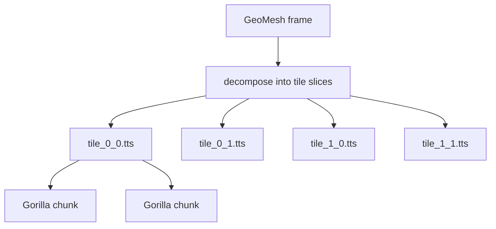

# Time-series API — `glen/timeseries`, `glen/sharded`, `glen/tilestack`

Three storage engines optimized for different workloads:

- **`glen/timeseries`** — **single scalar stream** per file. Write a flood of
  `(timestamp, float64)` per second; query by time window. Gorilla-encoded.
- **`glen/sharded`** — a logical series **partitioned across many files** by
  time bucket (hour / day / month / …) and/or geohash prefix. Same per-shard
  format as `glen/timeseries`; adds O(1) retention and bbox-restricted
  scans. Use this once a single series gets big enough that whole-file
  rewrites or a giant block index start to hurt.
- **`glen/tilestack`** — **2-D raster that evolves through time**. Write a
  full mesh per frame; query by frame, by time window, or by single cell
  history. Gorilla-encoded per cell.

All three share the bit-packing primitives in `glen/bitpack` (delta-of-delta
timestamps, XOR float encoding) and use a decoded-chunk LRU
(`glen/chunkcache`) on the read path.

## Gorilla scalar TSDB

One file per series, append-only, designed for many `(int64, float64)` per
second.

### Open / append

```nim
import glen/timeseries

let cpu = openSeries("./metrics/cpu.gts",
                     blockSize = 4096,
                     fsyncOnFlush = false,
                     decodedChunkCacheSize = 64)

cpu.append(tsMillis, value)
cpu.append(nowMillis(), 0.42)         # current wall time

cpu.flush()       # force pending samples to a new chunk on disk
cpu.close()       # also flushes
```

| Param | Default | Notes |
|---|---|---|
| `blockSize` | 4096 | Samples per chunk; larger = better compression, slower flush |
| `fsyncOnFlush` | false | true → fsync(2) every flush (durable, slow) |
| `decodedChunkCacheSize` | 64 | LRU slots for decoded chunks |

### Query

```nim
# Inclusive [from, to] range scan
for (ts, v) in cpu.range(fromMs, toMs): echo ts, " ", v

# Latest N (chronological order)
for (ts, v) in cpu.latest(100): echo ts, " ", v

# Whole-series iteration
for (ts, v) in cpu.items: echo ts, " ", v

# Stats
echo cpu.len           # total samples (closed + active)
echo cpu.minTs
echo cpu.maxTs
```

### Retention

```nim
let cutoff = nowMillis() - 7 * 86400 * 1000       # one week ago
cpu.dropBlocksBefore(cutoff)
```

Drops every block whose `endTs < cutoff`. Atomic temp-file rewrite — surviving
blocks are streamed byte-for-byte (no re-encoding). A block straddling the
cutoff is kept whole.

### File format

```
file header (16 B): magic "GLENGTS1" + version + reserved
repeated chunks:
  chunk header (40 B):
    payloadBytes  uint32   bytes after this header, including CRC
    count         uint32   samples in chunk
    startTs       int64
    endTs         int64
    minVal        float64  (over all samples in chunk; used for skip)
    maxVal        float64
  payload (bit-packed): DoD timestamps + Gorilla XOR values
  crc32: FNV-1a over payload
```

Range queries iterate the in-memory chunk index (built from the headers on
open) and decode only chunks whose `[startTs, endTs]` intersects the query.

### Compression

| Pattern | Bits/sample on disk |
|---|---|
| Constant value | ~2 bits (almost free) |
| Regular cadence + linear value | ~14 bits |
| Smooth (sin) | ~60 bits |
| Noisy fully-varying | ~60 bits |

For sensor / metric workloads (mostly slow-moving, occasional change), 1–3
bits/sample is typical.

### Reopen / torn tail

`openSeries` walks just the 40-byte block headers — payloads are not read,
not CRC-checked. The final block's CRC is verified to detect a torn tail
(mid-flush crash); if it fails, that block is dropped from the index and
the file truncated to the prior boundary. Per-block CRC validation is
deferred to read time in `readBlockAt`. As a result open is bounded by
`(num_blocks × 40 B)` of header I/O — a 10 GB series opens in seconds, not
minutes.

## Sharded series — `glen/sharded`

Use case: a logical series that grows past what a single file should hold.
Two pain points:

1. **Retention at scale.** `dropBlocksBefore` on a 10 GB monolithic series
   rewrites the whole file. With a daily time shard, dropping yesterday is
   one `removeFile` — O(1) instead of O(file size).
2. **Open / RAM cost on huge series.** A nine-billion-sample monolithic
   series carries a ~130 MB block index in process memory. Daily shards
   keep each in-memory index small; a bounded LRU of open shard handles
   means cold shards stay closed.

Optional **geographic sharding** (geohash prefix or a custom `(lon, lat)
→ key` function) further restricts query fan-out — a bbox-bounded `range`
only opens shards whose geohash cell intersects the box.

### Open

```nim
import glen/sharded
# Time-only: one file per day.
let p = tbDayPolicy()
# Geo + time: one file per (geohash-prefix-4, day) — ~20 km cells × daily.
let pg = geoTimePolicy(tbDay, geohashPrecision = 4)

let s = openShardedSeries(rootDir, pg,
                          blockSize = 4096,
                          fsyncOnFlush = false,
                          decodedChunkCacheSize = 64,
                          maxOpenShards = 64)
```

Or via the DB proxy:

```nim
import glen/dsl
let s = db.shardedSeries("temps", geoTimePolicy(tbDay, geohashPrecision = 4))
```

### Append

```nim
# Time-only policy:
s.append(tsMillis, value)

# Policies with a geo dimension require coords:
s.appendAt(tsMillis, lon, lat, value)
```

Appending the wrong flavour for the policy raises `ValueError`.

### Query

```nim
# All samples in a time window, fanned out across overlapping shards.
for (ts, v) in s.range(fromMs, toMs): use(ts, v)

# Bbox-restricted: only shards whose geo cell intersects `bbox` are opened.
for (ts, v) in s.rangeIn(bbox(-74.1, 40.6, -73.8, 40.9), fromMs, toMs):
  use(ts, v)

# Inspect:
let keys = s.shardKeysOnDisk()    # ["2026-04-15__9q5b", ...]
echo s.len                        # total samples across all shards
```

Results from `range` / `rangeIn` are sorted by timestamp even when they
come from many shards.

### Retention

```nim
let removed = s.dropBefore(nowMillis() - 30 * 86_400_000)
```

Closes any open handle and `removeFile`s every shard whose time bucket
ends strictly before the cutoff. Constant-time per shard regardless of
file size. Time-less policies (`tbNone`) return 0 — fall back to per-shard
`dropBlocksBefore` if you need that.

### Sharding policies

| Time bucket | Key example |
|---|---|
| `tbNone` | `""` (no time dimension) |
| `tbHour` | `2026-04-15-13` |
| `tbDay` | `2026-04-15` |
| `tbWeek` | `w0002912` (weeks since unix epoch) |
| `tbMonth` | `2026-04` |
| `tbYear` | `2026` |
| `tbCustomMs` | `c0000000000000060000` (1-minute buckets) |

| Geo bucket | Key example |
|---|---|
| `gbNone` | `""` (no geo dimension) |
| `gbGeohash`, precision 4 | `9q5b` |
| `gbCustom` | caller-supplied `(lon, lat) → string` |

At least one dimension must be active. Combined keys are written as
`<timeKey>__<geoKey>` to flat files under `<rootDir>/`.

For `gbCustom` to work with `rangeIn`, supply
`policy.customGeoCellsInBBox(b: BBox) → seq[string]` so the shard manager
can enumerate candidate cells without reading every file.

### Disk layout

```
<rootDir>/
├── 2026-04-15__9q5b.gts
├── 2026-04-15__dr5r.gts
├── 2026-04-16__9q5b.gts
└── …
```

Each `.gts` file is a regular `glen/timeseries` file — same format,
same primitives. The sharded layer is a thin router on top.

### Tuning

| Param | Default | Notes |
|---|---|---|
| `maxOpenShards` | 64 | Bounded LRU of open `Series` handles. Bump for high-fan-out queries; cut to keep file-descriptor pressure low |
| `decodedChunkCacheSize` | 64 | Passed through to each opened shard |
| `geohashPrecision` | — | 4 ≈ 20 km, 5 ≈ 5 km, 6 ≈ 1.2 km. Higher precision = more shard files; choose proportional to query selectivity |

## Tile time-stacks

Use case: a 2-D raster that evolves through time — radar reflectivity sweeps,
satellite-derived rasters, gridded weather model output, animated probability
fields from an LLM.



Each tile is an append-only file of Gorilla-encoded chunks. Each chunk
holds `chunkSize` frames worth of `tileSize² × channels` parallel
XOR-encoded streams sharing one timestamp stream.

### Open / append

```nim
import glen/tilestack, glen/geomesh, glen/geo

let stack = newTileStack("./radar/KMUX",
  bbox       = bbox(-122.7, 36.7, -120.7, 38.7),
  rows = 200, cols = 200, channels = 1,
  tileSize = 64,           # square tiles
  chunkSize = 128,         # frames per chunk
  labels = @["dbz"])

# Re-open (no need to re-pass dims)
let stack2 = openTileStack("./radar/KMUX")

# Ingest one frame
let mesh = buildFrame(...)         # GeoMesh matching stack dims
stack.appendFrame(scanTimeMs, mesh)

stack.flush()
stack.close()
```

| Param | Default | Notes |
|---|---|---|
| `tileSize` | 64 | side length in cells; smaller = more files, finer point-history granularity |
| `chunkSize` | 128 | frames per chunk; larger = better compression, slower flush |
| `labels` | `@[]` | optional per-channel names; resolve via `stack.channelIndex("dbz")` |

### Query

```nim
# Latest reconstructed frame (slow path — gathers all tiles)
let (ok, frame) = stack.readFrame(scanTimeMs)

# Frame range
for (ts, mesh) in stack.readFrameRange(fromMs, toMs):
  process(ts, mesh)

# Point history — touches only the one tile that owns the cell
for (ts, value) in stack.readPointHistory(myLon, myLat,
                                          fromMs = nowMs - 3_600_000,
                                          toMs   = nowMs,
                                          channel = 0):
  echo ts, " ", value

# Stats
echo stack.bbox
echo stack.rows, stack.cols, stack.channels
echo stack.tileSize, stack.chunkSize
echo stack.latestTs
echo stack.countChunks
echo stack.countActiveFrames
```

### Disk layout

```
<dir>/
├── manifest.tsm         ← text: bbox, dims, tile/chunk size, labels
├── tile_0_0.tts         ← per-tile chunked column store
├── tile_0_1.tts
└── tile_<r>_<c>.tts
```

Each `*.tts` file:

```
file header (16 B): magic "GLENTTS1" + version + reserved
repeated chunks:
  chunk header (40 B):
    payloadBytes uint32
    frameCount   uint32
    startTs      int64
    endTs        int64
    minVal       float64    (over all cells × channels in the chunk)
    maxVal       float64
  payload (bit-packed):
    timestamps stream (DoD)
    cellCount × channels parallel Gorilla XOR streams
  crc32 (FNV-1a)
```

### Compression

For radar-like data (sparse storms over mostly-clear sky), expect 20–30×
compression vs raw float storage. For fully-varying smooth data
(sin*cos everywhere), expect 2–3×.

### When to use what

| Workload | Pick |
|---|---|
| Latest scan / animate last hour / alert on threshold | **frame-per-doc** with `GeoMesh` field + range index on `tsMillis` |
| Long archive, point histories, disk cost matters | **TileStack** |
| Single sensor or metric stream | `glen/timeseries` (`Series`) |
| Dense grid of model output, queried by location | `GeoMesh` in a doc, polygon index for spatial lookup |

Mix freely — frame-per-doc for the hot 24h, TileStack for the long tail.

See [api/spatial.md#geomesh](spatial.md#geomesh) for the GeoMesh value type
that pairs with both patterns.

## Caching

All three engines back their reads with a decoded-chunk LRU
(`glen/chunkcache`). Repeated queries that hit the same chunks reuse the
decoded form instead of re-running the bit-unpacking loop. For
`glen/timeseries`, the cache stores `ref DecodedChunk` (parallel
`seq[int64]` / `seq[float64]`) so a hit is a refcount bump, not a deep
copy of the chunk; within-chunk lookups binary-search the timestamp
column.

| Workload | Speedup vs no cache |
|---|---|
| `series.range` (warm, 100-sample window) | **~110×** |
| `series.latest n=100` | ~5M q/s sustained |
| `series.latest n=1000` | ~880k q/s sustained |
| `tilestack.readPointHistory` (200×200) | ~5× |
| `tilestack.readFrame` (200×200) | ~4× |

For sharded series the same cache is configured per opened shard and
shared via the bounded shard-handle LRU (`maxOpenShards`).

Tunable via `decodedChunkCacheSize` (timeseries / sharded) and the
`cacheSize` arg to `openTileFile` (tilestack — exposed indirectly via the
default).

## See also

- [Architecture](../architecture.md) — how the standalone engines compose
- [Performance](../performance.md) — measured numbers
- [api/spatial.md](spatial.md) — GeoMesh (the value type tilestack frames produce)
- [WHITEPAPER.md](../../WHITEPAPER.md) — design rationale
