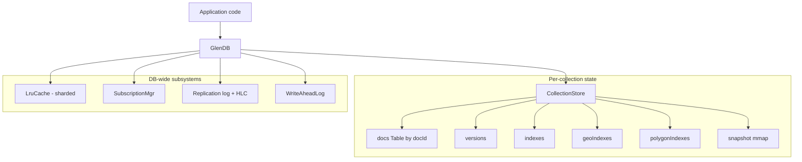
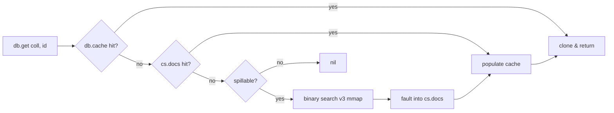
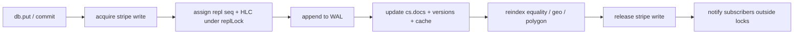
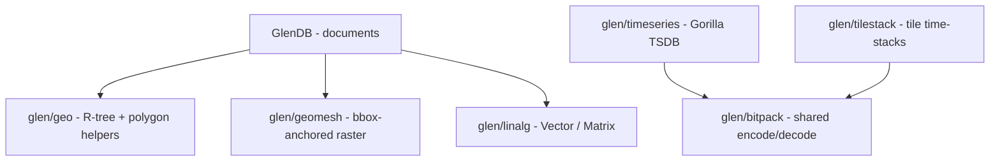

# Architecture

Glen is a single-process embedded database. Everything below runs in the
caller's address space — no daemon, no network, no fork.

## Components



A `GlenDB` is a `ref` holding:

- `collections: Table[name → CollectionStore]` — protected by a structural
  RW-lock. The outer table only changes when collections are created/dropped.
- An array of **per-collection stripe locks** (default 32) hashed by collection
  name; multi-collection transactions acquire stripes in sorted order to avoid
  deadlock. See [concurrency.md](concurrency.md).
- A **sharded LRU cache** fronting reads (default 16 shards, 64 MB budget).
- A **subscription manager** keyed by `collection:docId`.
- A **WAL** owning the on-disk segment files.
- An **in-memory replication log** + Hybrid Logical Clock for multi-master.

Each `CollectionStore` carries:

- `docs` — the in-memory hot working set
- `versions` — per-doc monotonic counters for OCC
- `indexes` / `geoIndexes` / `polygonIndexes` — secondary indexes
- `snapshot` — optional mmap'd `*.snap` file (active in spillable mode)
- `dirty` / `deleted` — spill-mode bookkeeping for in-memory mutations

## Read path



The borrowed-read variants skip the `clone()` step in the final stage —
appropriate for hot loops that won't mutate the returned `Value`.

## Write path



Write-ahead durability: the WAL append happens **before** any in-memory
mutation. If we crash between steps, recovery re-applies from the WAL on next
open. Subscriber callbacks fire after locks are released, so they can issue
their own DB calls without deadlock.

## On-disk layout

```
mydb/
├── glen.wal.0           ← active WAL segment
├── glen.wal.1
├── users.snap           ← per-collection snapshot (v3 by default)
├── orders.snap
├── node.id              ← stable replication node id
├── peers.state          ← persisted per-peer cursors
├── indexes.manifest     ← persisted index definitions (eq / geo / poly)
├── places.byLoc.gri     ← R-tree binary dump for "byLoc" geo index
└── zones.byShape.gpi    ← polygon index dump
```

Plus when used:
- `<dir>/<series>.gts` — Gorilla time-series files
- `<stackDir>/manifest.tsm` + `<stackDir>/tile_<r>_<c>.tts` — tile time-stack

See [storage.md](storage.md) for snapshot v3 layout details and
[storage.md#recovery](storage.md#recovery) for the recovery sequence.

## Independent subsystems

Some modules don't sit inside the document model — they're standalone storage
engines living in their own files but sharing the bit-packing primitives in
`glen/bitpack`:



- **`glen/timeseries`** — one file per series, append-only, Gorilla-encoded.
  See [api/timeseries.md](api/timeseries.md).
- **`glen/tilestack`** — directory of per-tile files; each tile is an
  append-only Gorilla chunk log. See [api/timeseries.md](api/timeseries.md#tile-time-stacks).
- **`glen/geomesh`** — value type only; rides inside ordinary documents.
  See [api/spatial.md](api/spatial.md#geomesh).
- **`glen/linalg`** — value type only; rides inside ordinary documents.
  See [api/numeric.md](api/numeric.md).

## Module map

| Module | Purpose |
|---|---|
| `glen/db` | High-level `GlenDB` API; wires WAL + cache + indexes + subscriptions |
| `glen/types` | `Value`, `Id`, `Hlc` and constructors |
| `glen/codec` | Binary encode/decode used by WAL, snapshots, replication |
| `glen/wal` | Segmented write-ahead log with FNV-1a checksums |
| `glen/storage` | Snapshot read/write (v1/v2/v3), mmap-backed reader |
| `glen/cache` | Sharded LRU cache fronting reads |
| `glen/subscription` | Doc-level / field-path / field-delta callbacks |
| `glen/txn` | Optimistic transaction state |
| `glen/index` | Equality + range index (CritBitTree) |
| `glen/geo` | R-tree (geo points + polygons), KNN, haversine |
| `glen/timeseries` | Gorilla scalar TSDB (standalone engine) |
| `glen/tilestack` | Tile time-stack (raster-over-time) (standalone) |
| `glen/geomesh` | Bbox-anchored raster value type |
| `glen/linalg` | Vector + Matrix value types and ops |
| `glen/bitpack` | Shared bit-packing primitives (DoD, Gorilla XOR) |
| `glen/chunkcache` | Decoded-chunk LRU shared by TSDB + tilestack |
| `glen/validators` | Zod-style schema DSL |
| `glen/rwlock` | Reader-prefer struct-rwlock |
| `glen/config` | Environment-variable knobs |
| `glen/util`, `glen/errors` | Misc helpers |

## Reading further

- [Storage and recovery](storage.md) — formats, durability semantics
- [Concurrency model](concurrency.md) — locks, transactions, replication
- [Spillable mode](spillable-mode.md) — datasets bigger than RAM
- [Performance](performance.md) — measured numbers on real hardware

For a long-form architectural reference, see [WHITEPAPER.md](../WHITEPAPER.md).
