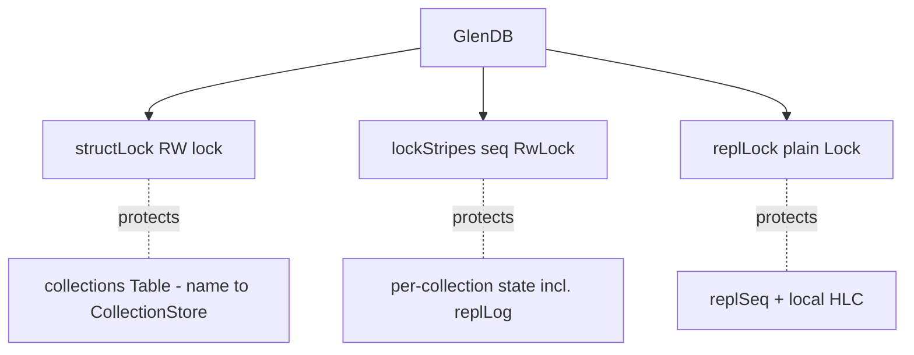
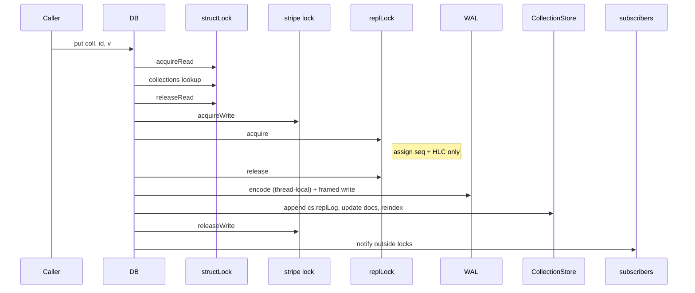
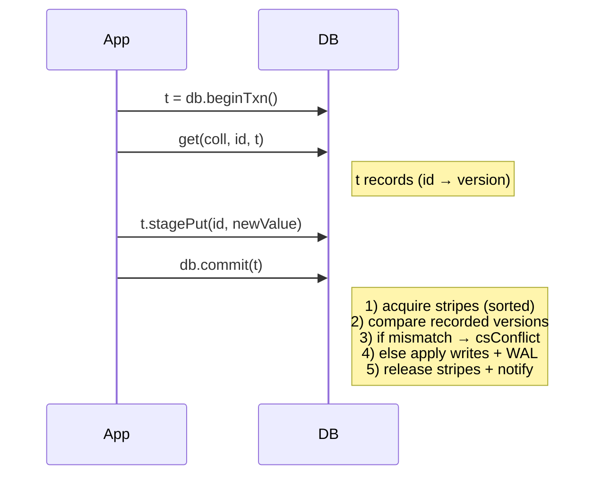
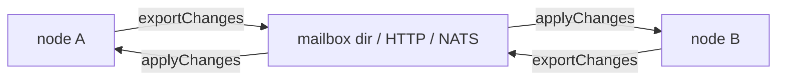
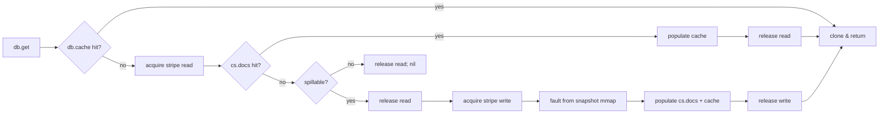

# Concurrency model

A single `GlenDB` is safe to share across threads. Concurrent writes to
different collections, concurrent first-writes to brand-new collections, and
concurrent index builds on disjoint collections all proceed in parallel.

## Locks at a glance



| Lock | Mode | Protects |
|---|---|---|
| `structLock` | reader-prefer RW | The outer `collections` map only. New-collection inserts take it write-mode. |
| `lockStripes[i]` | reader-prefer RW | All `CollectionStore` mutable state for collections hashed to stripe `i`, including `replLog`. Default 32 stripes. |
| `replLock` | plain mutex | The replication seq counter and local HLC mutation only. Held very briefly per write — the change-log entry itself goes into the writer's per-collection `replLog` under that collection's stripe lock, so disjoint-collection writers don't queue here. |

`db.cache` (sharded LRU) and `db.subs` (subscription manager) carry their
own internal locks; they are not shared with these.

## Stripe selection

Every collection hashes to one stripe via `hash(name) mod stripeCount`. A
single-collection mutation acquires that stripe's write lock; reads acquire
its read lock.



Multi-collection operations (`commit` over a transaction touching N
collections, `applyChanges` from replication) acquire **every needed stripe
in sorted order**:

```nim
var stripes: seq[int] = @[]
for key, _ in t.writes:
  stripes.add(db.stripeIndex(key.collection))
for k, _ in t.readVersions:
  stripes.add(db.stripeIndex(k.collection))
db.acquireStripesWrite(stripes)   # de-duped + sorted; deadlock-safe
```

Sorted acquisition guarantees a total order across all multi-stripe operations
→ no deadlock possible.

Global operations (`snapshotAll`, `compact`, `close`) acquire every stripe's
write lock + `structLock` read mode → quiesces the whole DB.

## Optimistic transactions (OCC)

Transactions track which versions you read and stage your writes locally.
On `commit`, Glen validates that nothing you read has been mutated by a
concurrent writer — if it has, the txn rolls back with `csConflict`.



**Important**: `commit` locks every stripe touched by **either** writes or
recorded reads. Without including read-only stripes, a concurrent writer to
a read collection could change the version between `recordRead` and
validation, causing a missed conflict.

`tx.state` is one of `tsActive`, `tsCommitted`, or `tsRolledBack`. Calling
`commit` on a non-active txn returns `csInvalid`.

## Replication (multi-master)

Glen ships the data plane only — bring your own transport.



Each mutation produces a `(seq, HLC, changeId, originNode)` tuple. `seq`
and the HLC are minted under `replLock` (held very briefly), then the
tuple is appended to the writing collection's `replLog` under that
collection's stripe write-lock — so two writers on different collections
don't serialise on a global change-log mutex:

- **`seq`** — local monotonic counter, drives the export cursor.
- **`HLC`** = `(wallMillis, counter, nodeId)` — Hybrid Logical Clock.
  `wallMillis` for human-readable time, `counter` for sub-millisecond
  ordering, `nodeId` for tie-breaking.
- **`changeId`** = `seq:nodeId` — globally unique; makes `applyChanges`
  idempotent.

```nim
# Sender
let (nextCursor, batch) = db.exportChanges(since = lastSentToPeer,
                                            includeCollections = @["users"])
# transport.send(peer, batch)
db.setPeerCursor("peerB", nextCursor)

# Receiver
db.applyChanges(received)
```

`exportChanges` snapshots each relevant collection's `replLog` under the
collection's stripe read-lock (binary-searching past `since`), then merges
and sorts the slices outside any DB lock. Filtered exports
(`includeCollections` / `excludeCollections`) and unfiltered ones share
the same path; concurrent writers on disjoint collections keep moving.

**Conflict resolution** is HLC-based last-write-wins per doc. On
`applyChanges`, each incoming change compares its HLC against the doc's
current HLC (stored in `cs.replMeta`, alongside its `changeId`) or the
highest pending HLC for that doc within the same batch; older changes are
dropped, newer ones win.

After receiving a remote change, Glen advances its local HLC past the
remote's `wallMillis/counter`, so future local writes always sort after the
freshest remote change it has seen.

`gcReplLog()` trims every per-collection log up to `min(peerCursors)`.
`setPeerCursor` calls it automatically, so the in-memory log shrinks as
peers ack with no manual GC ticker required.

See [api/core.md#replication](api/core.md#replication) for the full API.

## Read paths and the cache



The cache and snapshot fault both happen under proper locking. The borrowed
read variants (`getBorrowed`, `getBorrowedMany`, `getBorrowedAll`) skip the
final `clone()` — caller must not mutate the returned `Value`.

## Multi-threaded compilation

Single-threaded callers can use `--mm:orc` (the default).

Multi-threaded callers must use:

```
--mm:atomicArc -d:useMalloc --threads:on
```

ORC's cycle collector is not thread-safe across cross-thread `Value` refs and
will crash in `unregisterCycle` at shutdown. Glen's `Value` graph is acyclic,
so `atomicArc` has no functional downside.

## Tuning concurrency

| Knob | Default | When to bump |
|---|---|---|
| `lockStripesCount` | 32 | Many collections accessed in parallel; write contention dominates |
| `cacheShards` | 16 | Set ≥ writer-thread count; minimises per-shard contention |
| `cacheCapacity` | 64 MiB | Hot working set is large; size at 1–2× working set |

See [api/core.md#configuration](api/core.md#configuration) for the constructor
arg + env-var table.
