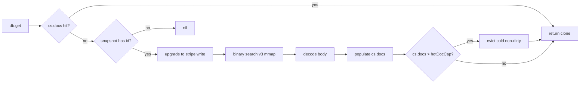
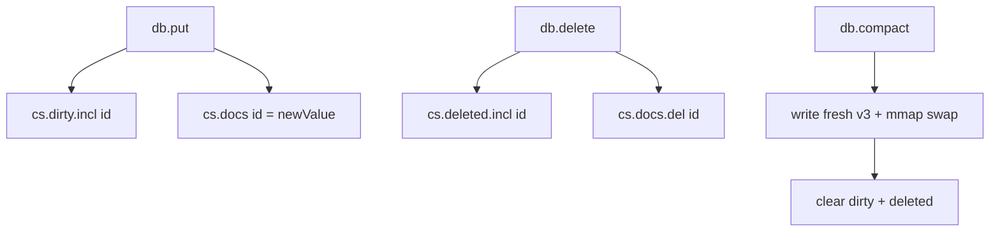
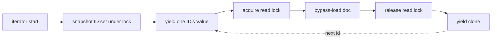
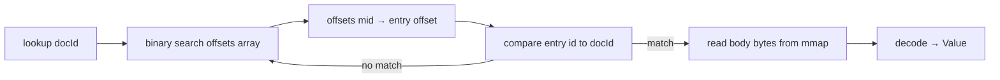

# Spillable mode

Glen's default mode loads every document into memory at open. **Spillable
mode** flips the contract: documents are faulted in on demand from a
memory-mapped snapshot, with optional LRU eviction of cold doc bodies. Combined
with the **paged on-disk doc index** (snapshot v3) and **streaming
iterators**, you can operate on databases meaningfully larger than RAM.

## When to use it

| Situation | Mode |
|---|---|
| Working set fits in RAM, want fastest reads | eager (default) |
| Dataset bigger than RAM | spillable |
| Edge / embedded device with constrained memory | spillable + small `hotDocCap` |
| Archive that's queried for a small fraction at a time | spillable |
| All-loaded ingest pipeline | eager |

For a fully-loaded working set, eager mode is faster — no fault path, no mmap
deref, no LRU bookkeeping. Spillable mode trades a small per-cold-fault
constant factor for a removed RAM ceiling.

## Opening in spillable mode

```nim
let db = newGlenDB("./big.glen",
                   spillableMode = true,
                   hotDocCap     = 10_000)   # 0 means unbounded
```

- **`spillableMode = true`** — opens snapshot via mmap, defers loading
  individual doc bodies until first access.
- **`hotDocCap`** — soft limit on `cs.docs.len`. When exceeded, the LRU
  evicts a cold non-dirty doc on each subsequent fault. `0` (default) means
  unbounded (faulted docs accumulate but never evict).

## Read path



Subsequent reads of the same doc hit `cs.docs` and skip the fault. Repeated
reads of an evicted doc re-fault — bounded constant cost, no asymptotic
penalty.

## Tombstones and dirty docs

Mutations stay in memory and the WAL until the next `compact()`:



- **Dirty entries** can't be evicted — their value lives only in memory + the
  WAL, not in the current snapshot. Eviction would lose data.
- **Deleted entries** become tombstones until the next compact. `db.get`
  returns `nil` for a tombstoned id even if the underlying snapshot still
  has the body.
- **`compact()`** rewrites a fresh v3 snapshot from `materializeAllDocs()`
  (combining mmap reads + dirty cs.docs entries, skipping tombstones), swaps
  the mmap, and clears the dirty/deleted sets. Memory pressure drops back
  to baseline.

## In-flight memory guardrail

Multi-doc operations check `maxDirtyDocs` *before* applying any writes:

```nim
let db = newGlenDB("./big.glen",
                   spillableMode = true,
                   maxDirtyDocs  = 100_000)

# Will fail cleanly instead of consuming memory:
try:
  db.putMany("events", hugeBatch)        # raises ValueError if too big
except ValueError as e:
  echo e.msg                              # "spill: would exceed maxDirtyDocs..."
  db.compact()                            # flush dirty, retry smaller batch
```

| Operation | Behaviour on overflow |
|---|---|
| `commit` | Returns `CommitResult(status: csInvalid, message: …)` |
| `applyChanges` / `putMany` / `deleteMany` | Raises `ValueError` |

`maxDirtyDocs = 0` (default) means no cap, matching the prior behaviour
exactly.

## Streaming iterators

For bulk reads where you don't want to materialize the whole result in RAM:

```nim
# Walk a 10M-doc collection holding ~one Value at a time
for (id, doc) in db.getAllStream("events"):
  process(id, doc)
```

The iterator captures the matching ID set under a brief lock (~30 bytes per
ID), then yields one Value at a time, releasing and re-acquiring the stripe
lock between yields so concurrent writers can interleave. Mid-iteration
deletes are tolerated (the doc is silently skipped).

Available variants:

| Iterator | Equivalent non-streaming proc |
|---|---|
| `getAllStream` / `getBorrowedAllStream` | `getAll` / `getBorrowedAll` |
| `getManyStream` / `getBorrowedManyStream` | `getMany` / `getBorrowedMany` |
| `findByStream` / `rangeByStream` | `findBy` / `rangeBy` |
| `findInBBoxStream` / `findNearestStream` | `findInBBox` / `findNearest` |
| `findWithinRadiusStream` | `findWithinRadius` |
| `findPolygonsContainingStream` | `findPolygonsContaining` |
| `findPolygonsIntersectingStream` | `findPolygonsIntersecting` |
| `findPointsInPolygonStream` | `findPointsInPolygon` |



## Snapshot v3 paged index

The doc index itself is paged on disk. v3 lays out a **sorted offsets
table** next to the entries; lookups binary-search that table directly through
the OS page cache via mmap.

```
v3 layout:
  header (40 B): magic + version + docCount + section offsets
  bodies   : encoded values, sorted by docId
  entries  : variable-size (idLen, id, bodyOffset, bodyLength), sorted
  offsets  : docCount × uint64, each pointing into entries
```



Lookup is `O(log₂ n)` page reads, each touching ~64 bytes. For a 100M-doc
DB on this hardware:

- Open: **0.03 ms** (just the 40-byte header)
- Random lookup: **2.3M q/s** (release; cold path through mmap)
- Resident index footprint: **0 bytes** (OS page cache only)
- On-disk overhead: **~36 bytes/doc** for the index portion

`compact()` writes v3 by default; `loadSnapshot` (eager) and
`openSnapshotMmap` (spill) auto-detect v1/v2/v3, so existing databases keep
working through any version transition.

See [storage.md#snapshot-formats](storage.md#snapshot-formats) for the full
file layout.

## Iteration order

| Mode | `getAllStream`, `iterIds`, `allDocIds` order |
|---|---|
| Eager (in-memory `cs.docs`) | Insertion order |
| Spillable, v2 mmap | Insertion order |
| Spillable, v3 mmap | **Lexicographic by docId** |

Useful for export, comparison, dedup. If your workload depends on insertion
order, fall back to v2 (`writeSnapshotV2` is still available).

## Tradeoffs

For a non-RAM-constrained system:

| | Eager | Spillable |
|---|---|---|
| Open time, 100k docs | hundreds of ms | **0.03 ms** |
| Resident index RAM | ~3.6 MB / 100k docs | **0 bytes** |
| Hot-read latency | ~100 ns (Table hit) | ~100 ns (cs.docs hit) |
| Cold-snapshot lookup | (n/a — all loaded) | ~430 ns (mmap + bsearch) |
| DB size ceiling | bounded by RAM | bounded by disk |
| Iteration of snapshot-only docs | (n/a) | ~2× slower per-id |

Net: spillable is strictly better for opening, growing, evicting; modestly
slower in narrow scenarios that hammer the cold-snapshot-lookup path with no
caching. For everyone else, just turn it on.

## Reading further

- [Architecture](architecture.md) — how spill mode integrates with the rest
- [Storage](storage.md) — v3 file format detail
- [Performance](performance.md) — numbers and tradeoffs
- [api/core.md](api/core.md) — `newGlenDB` constructor args, the streaming-iterator API
