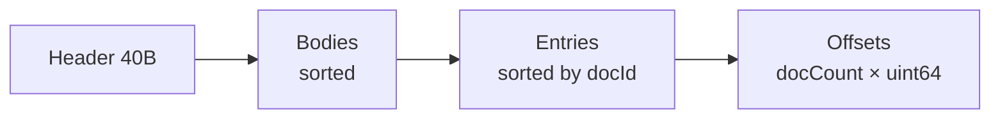
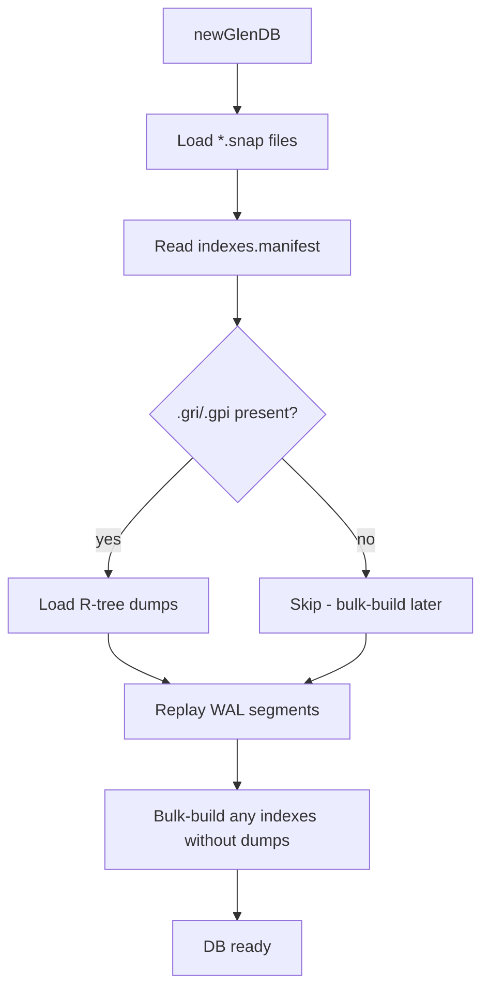

# Storage and recovery

Glen's durability story is **WAL + snapshot**: every mutation appends a
length-prefixed, checksummed record to a write-ahead log; periodically
`compact()` flushes a fresh per-collection snapshot and resets the WAL.
Recovery on open replays the WAL on top of whatever the snapshots hold.

## Files in a Glen directory

```
mydb/
├── glen.wal.0           ← active write-ahead segment
├── glen.wal.1           ← rotated segments (when wal.0 fills)
├── users.snap           ← per-collection snapshot (v3 by default)
├── orders.snap
├── node.id              ← stable replication node id (auto-generated if absent)
├── peers.state          ← persisted per-peer replication cursors
├── indexes.manifest     ← persisted index definitions (eq / geo / poly)
├── places.byLoc.gri     ← R-tree binary dump for geo index "byLoc"
└── zones.byShape.gpi    ← R-tree binary dump for polygon index "byShape"
```

When the optional standalone engines are used:

```
metrics/
├── cpu.gts              ← Gorilla scalar TSDB file (see api/timeseries.md)
└── ...

radar/KMUX/
├── manifest.tsm         ← tile time-stack config
└── tile_<r>_<c>.tts     ← per-tile chunked column store
```

## WAL (`glen.wal.N`)

- **Segmented**: rotates when the active segment exceeds a threshold; each
  segment is `glen.wal.<N>`.
- **Header**: every fresh segment writes `GLENWAL2` (magic + version) before
  the first record.
- **Record format**: `varuint bodyLen | uint32 fnv1a-checksum | body`.
  Body is the codec-encoded mutation (put or delete, with version, hlc,
  changeId, originNode).
- **Sync policies**:
  - `wsmAlways` — `flushFile` after every record. Strict durability, low
    write rate.
  - `wsmInterval` *(default)* — flush every `flushEveryBytes` (default 8 MiB).
  - `wsmNone` — rely on OS page cache. Bulk imports / throwaway DBs only.
- **Recovery**: replay reads each segment in order, validating checksum +
  length. The first invalid tail record halts replay for that segment; later
  segments are still consulted. Crash-mid-record is tolerated.

## Snapshot formats

`compact()` writes one `*.snap` file per collection. Three on-disk versions
exist; readers auto-detect.

### v1 (legacy)

```
varuint numDocs
repeated:
  varuint idLen | id bytes | varuint valLen | encoded value
```

No magic bytes. Loaded by streaming through the file. Still supported for
read-back.

### v2 (in-memory hash index)

```
magic "GLENSNP2" (8 B)
version uint32 (= 2)
docCount uint32
[index entries × docCount]:
  idLen uint32 | id bytes | bodyOffset uint64 | bodyLength uint32
[body section]:
  encoded values
```

Loaded by reading the entire index into a `Table[string, ...]`. Lookups are
O(1) hash hits but the entire index is RAM-resident. Replaced by v3 as
the default.

### v3 (paged on-disk index, default)

```
header (40 B):
  magic         "GLENSNP3" (8 B)
  version       uint32     (4 B, = 3)
  docCount      uint32     (4 B)
  bodiesStart   uint64     (8 B)
  entriesStart  uint64     (8 B)
  offsetsStart  uint64     (8 B)
bodies section:
  encoded values, sorted by docId, concatenated
entries section (sorted by docId):
  for each: idLen uint32 | id bytes | bodyOffset uint64 | bodyLength uint32
offsets section:
  docCount × uint64, each pointing into entries
```

Lookup: binary-search the offsets table; for each midpoint, deref into
entries to compare ids. With mmap, only the file pages actually touched stay
resident — the OS page cache handles paging.



Why two sorted sections + an offsets table instead of just one?
- Entries are variable-size, so direct random access requires the offsets
  array.
- Bodies are stored in the same sorted order so iteration produces sequential
  I/O.

## Recovery



Recovery order on `newGlenDB(dir)`:

1. **Scan `*.snap`**: for each, build a `CollectionStore`. In **eager mode**
   (default), decode every entry into `cs.docs`. In **spillable mode**, just
   `mmap` the file and read the index header — entries fault on demand.
2. **Read `indexes.manifest`**: enumerate persisted index definitions.
   For spatial indexes, try to load the matching `.gri`/`.gpi` binary dump
   into the R-tree. CRC mismatch → silently fall back to bulk-rebuild.
3. **Replay every WAL segment** in order. Each record advances the in-memory
   replication seq, restores per-doc HLC + changeId metadata, and updates any
   loaded indexes incrementally — so post-compact mutations are reflected on
   any `.gri`/`.gpi`-loaded tree.
4. **Bulk-build** any equality / geo / polygon index that didn't have a dump
   loaded, walking all docs (eager: cs.docs; spill: snapshot + cs.docs).
5. Restore replication metadata (HLC, changeId per doc) and per-peer
   replication cursors from `peers.state`.

The whole process is read-only on the on-disk side — no file is rewritten
during open. Crash-during-recovery is therefore safe.

## Compaction

`db.compact()`:

1. Acquire all stripes write-mode + structLock read-mode.
2. For each collection, build the doc set (eager: just `cs.docs`; spill:
   `materializeAllDocs` combining mmap + dirty + tombstones).
3. Write a **fresh v3 snapshot** atomically (temp file + rename).
4. Dump every `geoIndex` to `<collection>.<name>.gri` and every
   `polygonIndex` to `<collection>.<name>.gpi`.
5. In spill mode: close the old `*.snap` mmap, reopen the new one, clear
   `dirty` / `deleted` sets.
6. **Reset the WAL** to segment 0.

Snapshot writes are atomic: temp file + `rename(2)` (POSIX) or
temp + remove + move (Windows).

After compact, the WAL is empty and the snapshot reflects the live state.
A crash before the WAL reset doesn't lose data — the new snapshot is already
durable, and replay will simply re-apply WAL records, all of which are
idempotent under the per-doc version/HLC scheme.

## Backup and restore

Snapshot-based:

```
db.snapshotAll()           # writes *.snap atomically
# then copy *.snap, *.gri, *.gpi, indexes.manifest, peers.state, glen.wal.*
# to your backup target
```

Restore by placing those files in a directory and opening with `newGlenDB`.

## Tuning durability

Knobs are constructor args (or env-var-driven via `newGlenDBFromEnv`):

| Knob | Default | Effect |
|---|---|---|
| `walSync` | `wsmInterval` | `wsmAlways` / `wsmInterval` / `wsmNone` |
| `walFlushEveryBytes` | 8 MiB | bytes between fsyncs in interval mode |
| `cacheCapacity` | 64 MiB | LRU cache budget |
| `cacheShards` | 16 | LRU shard count |
| `lockStripesCount` | 32 | per-collection stripe count |

See [api/core.md#configuration](api/core.md#configuration) for the full env-var
table.

## Reading further

- [Concurrency](concurrency.md) — what locks the WAL append serializes against
- [Spillable mode](spillable-mode.md) — v3 paged-index details
- [Performance](performance.md) — measured open / compact / lookup costs
