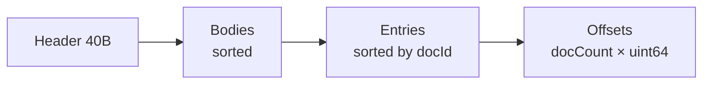
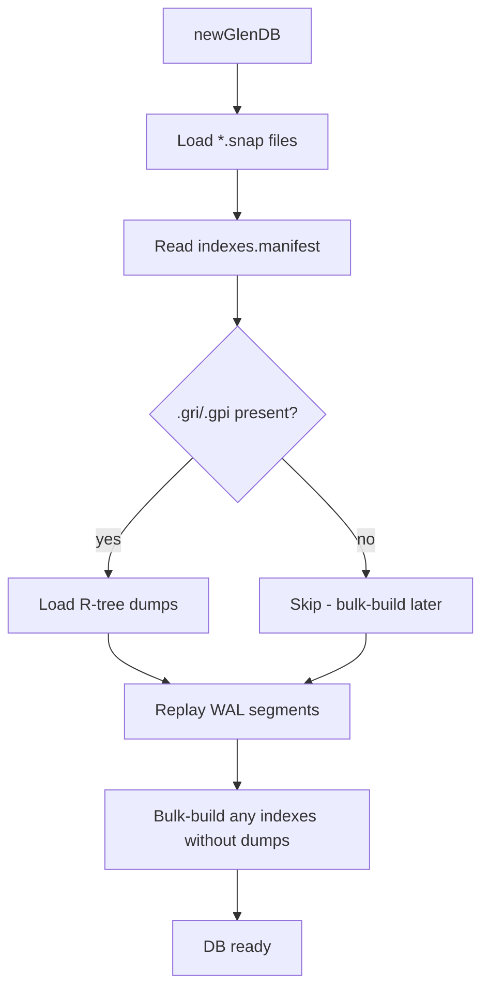

# Storage and recovery

Glen's durability story is **WAL + snapshot**: every mutation appends a
length-prefixed, checksummed record to a write-ahead log; periodically
`compact()` flushes a fresh per-collection snapshot and resets the WAL.
Recovery on open replays the WAL on top of whatever the snapshots hold.

## Files in a Glen directory

```
mydb/
├── glen.wal.0           ← active write-ahead segment
├── glen.wal.1           ← rotated segments (when wal.0 fills)
├── users.snap           ← per-collection snapshot (v3 by default)
├── orders.snap
├── node.id              ← stable replication node id (auto-generated if absent)
├── peers.state          ← persisted per-peer replication cursors
├── indexes.manifest     ← persisted index definitions (eq / geo / poly / vec)
├── places.byLoc.gri     ← R-tree binary dump for geo index "byLoc"
├── zones.byShape.gpi    ← R-tree binary dump for polygon index "byShape"
└── docs.byEmb.vri       ← HNSW graph dump for vector index "byEmb"
```

When the optional standalone engines are used:

```
metrics/
├── cpu.gts              ← Gorilla scalar TSDB file (see api/timeseries.md)
└── ...

radar/KMUX/
├── manifest.tsm         ← tile time-stack config
└── tile_<r>_<c>.tts     ← per-tile chunked column store
```

## WAL (`glen.wal.N`)

- **Segmented**: rotates when the active segment exceeds a threshold; each
  segment is `glen.wal.<N>`.
- **Header**: every fresh segment writes `GLENWAL2` (magic + version) before
  the first record.
- **Record format**: `varuint bodyLen | uint32 fnv1a-checksum | body`.
  Body is the codec-encoded mutation (put or delete, with version, hlc,
  changeId, originNode).
- **Sync policies**:
  - `wsmAlways` — `flushFile` after every record. Strict durability, low
    write rate.
  - `wsmInterval` *(default)* — flush every `flushEveryBytes` (default 8 MiB).
  - `wsmNone` — rely on OS page cache. Bulk imports / throwaway DBs only.
- **Recovery**: replay reads each segment in order, validating checksum +
  length. The first invalid tail record halts replay for that segment; later
  segments are still consulted. Crash-mid-record is tolerated.

## Snapshot formats — quick reference

| Version | When written | Read by | Notes |
|---|---|---|---|
| v1 | legacy | v1+ readers | varuint stream; eager-only, no random access |
| v2 | superseded | v2+ readers | first mmap-friendly indexed format |
| v3 | superseded | v3+ readers | paged on-disk index for spillable mode |
| v4 | **default** | v4+ readers | adds key + value dictionaries |

v1 / v2 / v3 files keep working transparently; new writes from `compact()`
are v4. `loadSnapshot` and `openSnapshotMmap` auto-detect by magic bytes.

## Snapshot v4 — key + value dictionaries

v4 carries an optional pair of per-snapshot dictionaries that compress
repeated bytes in document bodies:

- **Key dictionary**: every object-field name (recursively, including
  nested objects) that appears in `≥ keyDictThreshold` (default 4) docs gets
  a small int id. Body field markers reference the id instead of re-emitting
  the string.
- **Value dictionary**: per-field, every string value that appears in
  `≥ valueDictThreshold` (default 8) docs gets an id within that field's
  sub-dict. Status enums, region codes, severity levels — anything with a
  small repeated vocabulary — collapse to one varuint per occurrence.

Both are recomputed from scratch on every `compact()` (so the dicts stay
clean as the schema evolves), built in two passes through the doc set
before bodies are written.

### Layout

```
header (56 B):
  magic        "GLENSNP4"  (8)
  version      uint32      (4, = 4)
  docCount     uint32      (4)
  dictStart    uint64      (8)   abs offset (0 if no dicts)
  bodiesStart  uint64      (8)
  entriesStart uint64      (8)
  offsetsStart uint64      (8)
  flags        uint32      (4)   bit 0 = HasKeyDict, bit 1 = HasValueDict
  reserved     uint32      (4)
[dict section, when flags has any dict bit set]:
  if HasKeyDict:
    keyCount uint32
    [keyLen uint32 + keyBytes] × keyCount     # idToKey[i] = i'th entry
  if HasValueDict:
    fieldCount uint32
    [fieldNameLen uint32 + bytes
       valueCount uint32
       [valueLen uint32 + bytes] × valueCount] × fieldCount
bodies, entries, offsets: same layout as v3.
```

### Body encoding

Bodies in v4 may use one of two object tags:

- `TAG_OBJECT` (8) — legacy, all keys inline. WAL records and replication
  payloads always use this since they have no shared dict scope.
- `TAG_OBJECT_DICT` (10) — per-field varuint key-marker:
  - low bit `1` → dict-id = `marker shr 1`
  - low bit `0` → inline; length = `marker shr 1`, then bytes
- For string values whose `(field, value)` pair has a value-dict id,
  `TAG_STRING_DICT` (11) replaces `TAG_STRING` (5): one byte tag + one
  varuint id. Other value kinds unchanged.

The decoder dispatches on tag and uses the bound dict (`decodeWithDict`)
to resolve refs. Plain `decode` raises on `TAG_OBJECT_DICT` /
`TAG_STRING_DICT` since those need a dict in scope.

### Cost trade-off

Compaction is ~30–50% slower than v3 due to the two pre-passes that count
key + value frequencies. For workloads with substantial repetition (status
enums, structured user/order/event records), the disk savings + reduced
mmap working set repay this many times over. For workloads with
near-unique values everywhere (geo coordinate dumps, random keys),
compaction pays the cost without earning savings — set the thresholds
to `0` via `writeSnapshotV4(...; keyDictThreshold = 0,
valueDictThreshold = 0)` to opt out at compact time.

## Snapshot formats

`compact()` writes one `*.snap` file per collection. Three on-disk versions
exist; readers auto-detect.

### v1 (legacy)

```
varuint numDocs
repeated:
  varuint idLen | id bytes | varuint valLen | encoded value
```

No magic bytes. Loaded by streaming through the file. Still supported for
read-back.

### v2 (in-memory hash index)

```
magic "GLENSNP2" (8 B)
version uint32 (= 2)
docCount uint32
[index entries × docCount]:
  idLen uint32 | id bytes | bodyOffset uint64 | bodyLength uint32
[body section]:
  encoded values
```

Loaded by reading the entire index into a `Table[string, ...]`. Lookups are
O(1) hash hits but the entire index is RAM-resident. Replaced by v3 as
the default.

### v3 (paged on-disk index, default)

```
header (40 B):
  magic         "GLENSNP3" (8 B)
  version       uint32     (4 B, = 3)
  docCount      uint32     (4 B)
  bodiesStart   uint64     (8 B)
  entriesStart  uint64     (8 B)
  offsetsStart  uint64     (8 B)
bodies section:
  encoded values, sorted by docId, concatenated
entries section (sorted by docId):
  for each: idLen uint32 | id bytes | bodyOffset uint64 | bodyLength uint32
offsets section:
  docCount × uint64, each pointing into entries
```

Lookup: binary-search the offsets table; for each midpoint, deref into
entries to compare ids. With mmap, only the file pages actually touched stay
resident — the OS page cache handles paging.



Why two sorted sections + an offsets table instead of just one?
- Entries are variable-size, so direct random access requires the offsets
  array.
- Bodies are stored in the same sorted order so iteration produces sequential
  I/O.

## Recovery



Recovery order on `newGlenDB(dir)`:

1. **Scan `*.snap`**: for each, build a `CollectionStore`. In **eager mode**
   (default), decode every entry into `cs.docs`. In **spillable mode**, just
   `mmap` the file and read the index header — entries fault on demand.
2. **Read `indexes.manifest`**: enumerate persisted index definitions.
   For spatial indexes, try to load the matching `.gri`/`.gpi` binary dump
   into the R-tree. CRC mismatch → silently fall back to bulk-rebuild.
3. **Replay every WAL segment** in order. Each record advances the in-memory
   replication seq, restores per-doc HLC + changeId metadata, and updates any
   loaded indexes incrementally — so post-compact mutations are reflected on
   any `.gri`/`.gpi`-loaded tree.
4. **Bulk-build** any equality / geo / polygon index that didn't have a dump
   loaded, walking all docs (eager: cs.docs; spill: snapshot + cs.docs).
5. Restore replication metadata (HLC, changeId per doc) and per-peer
   replication cursors from `peers.state`.

The whole process is read-only on the on-disk side — no file is rewritten
during open. Crash-during-recovery is therefore safe.

## Compaction

`db.compact()`:

1. Acquire all stripes write-mode + structLock read-mode.
2. For each collection, build the doc set (eager: just `cs.docs`; spill:
   `materializeAllDocs` combining mmap + dirty + tombstones).
3. Write a **fresh v3 snapshot** atomically (temp file + rename).
4. Dump every `geoIndex` to `<collection>.<name>.gri`, every
   `polygonIndex` to `<collection>.<name>.gpi`, and every `vectorIndex`
   to `<collection>.<name>.vri`.
5. In spill mode: close the old `*.snap` mmap, reopen the new one, clear
   `dirty` / `deleted` sets.
6. **Reset the WAL** to segment 0.

Snapshot writes are atomic: temp file + `rename(2)` (POSIX) or
temp + remove + move (Windows).

After compact, the WAL is empty and the snapshot reflects the live state.
A crash before the WAL reset doesn't lose data — the new snapshot is already
durable, and replay will simply re-apply WAL records, all of which are
idempotent under the per-doc version/HLC scheme.

### Auto-compaction

`compact()` is manual by default. For long-running services, three
constructor knobs let the DB self-trigger:

- `compactWalBytes` — fire when total WAL bytes ≥ N
- `compactIntervalMs` — fire when ≥ N ms have elapsed since the last compact
- `compactDirtyCount` — fire when summed `cs.dirty.len` ≥ N (spill-mode only)

All checks happen at the end of every mutation (after locks release); a
re-entrancy atomic prevents two threads from compacting in parallel. Set any
trigger to `0` to disable it; the default of `0`/`0`/`0` keeps things manual.

### Tile-chunk RLE + Simple-8b

The tilestack chunk format (`*.tts`) was bumped to v2:

- **Constant-chunk RLE** (bit 31 of the chunk-header `payloadBytes`): when
  every cell-channel-frame in a chunk holds the same float64, the payload
  collapses to "timestamps + 1 × float64" — typically a few hundred bytes
  vs hundreds of KB for a Gorilla full chunk. Wins big on clear-sky radar
  pixels and other flat raster regions.
- **Simple-8b timestamp codec** (bit 30 of `payloadBytes`): encoder writes
  whichever of DoD or Simple-8b emits fewer bits for each chunk's
  zigzag-DoD timestamp deltas. Regular cadence (constant inter-frame
  interval) RLEs into a handful of 64-bit words.

v1 readers can't open v2 files (version bump is hard); v2 readers handle v1
files transparently because v1 chunks always have bits 30 + 31 clear.

### Bit-decode hot path

`glen/bitpack` is the shared bit-packing primitive for both TSDB blocks and
tilestack chunks. Three optimisations now apply:

- **64-bit batched `BitReader`**. Instead of pulling one bit per call, the
  reader keeps a 64-bit cache register filled from the byte buffer, MSB-
  first. `readBitsU64(N)` masks + shifts in a single op when the cache has
  ≥N bits, falls back to a two-phase drain-refill-take when it doesn't.
  Net effect: full-width Gorilla XOR decode (`decodeXor` on a 50-bit/value
  smooth float stream) is **~12× faster**; constant-stream decode (1-bit
  early exits per value) is ~30% slower per call due to a bit more cache
  bookkeeping. The mixed real-world workload (TSDB `range` queries) is
  **~6× faster** end-to-end.
- **Hardware `clz`/`ctz`**. `countLeadingZeros64`/`countTrailingZeros64`
  now use `__builtin_clzll`/`__builtin_ctzll` when compiling under gcc or
  clang, lowering to `lzcnt`/`tzcnt` on x86-64 BMI and `clz`/`rbit+clz` on
  arm64. ~16–18× faster than the scalar bit-shift fallback that's still
  used on other compilers.
- **`decodeXorRun` zero-run skip**. The single-bit "XOR is zero" early
  exit is the dominant case for radar / raster data with constant cells.
  Per-call decoding pays one `readBit` per zero. `decodeXorRun(n)` instead
  inspects the BitReader's 64-bit cache, runs `clz` to count leading-zero
  bits, and bulk-skips up to 64 zero-XOR values per instruction. Microbench
  on a constant-XOR stream: per-call 12 µs / 4096 vals → batched **5.3 µs
  = 2.3× faster**. On dense (mostly non-zero) streams it's ~9% slower due
  to the extra seq allocation, so use it only where zero-runs are
  expected (which is what tilestack's `ckGorilla` path now does).

Note on NEON. arm64 NEON has no PEXT/PDEP analog, so the variable-length
prefix codes of `decodeXor` and `decodeDoD` aren't directly vectorisable.
A 2-way parallel prefix-XOR-scan reconstruction was prototyped using
`veorq_u64`, but the per-iteration lane shuffling (`vsetq_lane`/`vgetq_lane`)
canceled the parallelism win — the scalar reconstruction loop was already
fast enough. The hardware-accelerated bits — `clz` for zero-run skip,
`__builtin_clzll`/`__builtin_ctzll` for primitives — are arm64 instructions
but not strictly NEON.

## Backup and restore

Snapshot-based:

```
db.snapshotAll()           # writes *.snap atomically
# then copy *.snap, *.gri, *.gpi, indexes.manifest, peers.state, glen.wal.*
# to your backup target
```

Restore by placing those files in a directory and opening with `newGlenDB`.

## Tuning durability

Knobs are constructor args (or env-var-driven via `newGlenDBFromEnv`):

| Knob | Default | Effect |
|---|---|---|
| `walSync` | `wsmInterval` | `wsmAlways` / `wsmInterval` / `wsmNone` |
| `walFlushEveryBytes` | 8 MiB | bytes between fsyncs in interval mode |
| `cacheCapacity` | 64 MiB | LRU cache budget |
| `cacheShards` | 16 | LRU shard count |
| `lockStripesCount` | 32 | per-collection stripe count |

See [api/core.md#configuration](api/core.md#configuration) for the full env-var
table.

## Reading further

- [Concurrency](concurrency.md) — what locks the WAL append serializes against
- [Spillable mode](spillable-mode.md) — v3 paged-index details
- [Performance](performance.md) — measured open / compact / lookup costs
